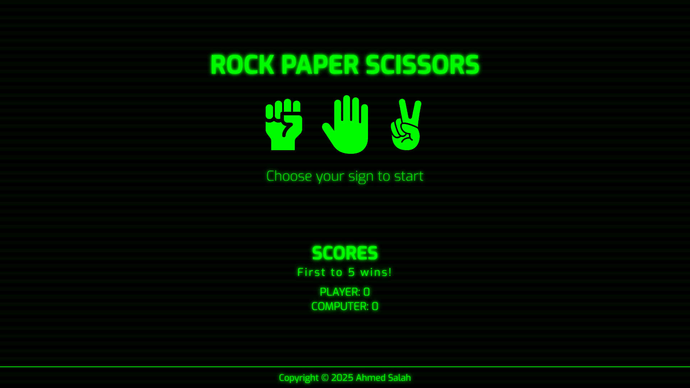

# Rock Paper Scissors

[](https://opensource.org/licenses/MIT)

Step back in time with this Rock Paper Scissors game, styled with a retro CRT terminal aesthetic! Pixelated fonts, scan lines, and a classic green glow to bring a nostalgic vibe to this timeless game.

**[➡️ Live Preview](https://4hmedsalah.github.io/rock-paper-scissors/)**

<p align="center"></p>

## 🌟 Features

- **👾 Retro CRT Aesthetics:** Immerse yourself in a classic computer terminal experience with:
  - Pixelated text rendering
  - Authentic screen flicker effects
  - Signature green glowing visuals
  - Simulated scan lines
- **🖱️ Interactive UI:**
  - Engaging hover effects on buttons
  - Smooth animations for a dynamic feel
- **🎮 Dynamic Gameplay:**
  - Clear on-screen updates for game status, player choices, and results.
  - Responsive design ensuring a great experience on both desktop and mobile devices.
- **📚 Educational Core:** Built as part of The Odin Project, reinforcing JavaScript fundamentals:
  - Functions and conditional logic
  - User input handling
  - DOM manipulation and event listeners for button interactivity

## 🛠️ Technologies Used

- **HTML:** For the structural backbone of the game.
- **CSS:** For all styling, including the CRT effects, animations, and responsive design.
- **JavaScript:** For the game logic, user interactions, and dynamic content updates.

## 🚀 Getting Started

You can jump right into the game using the **[➡️ Live Preview](https://4hmedsalah.github.io/rock-paper-scissors/)** or set it up on your local machine.

**For a local setup:**

1.  Clone the repository:
    ```bash
    git clone https://github.com/4hmedsalah/rock-paper-scissors.git
    cd rock-paper-scissors
    ```
2.  Open `index.html` in your preferred web browser.

## 룰 How to Play

1.  **Make your choice:** Click on one of the three buttons: "Rock", "Paper", or "Scissors".
2.  **See the computer's choice:** The computer will randomly select its move.
3.  **Check the result:** The game will display whether you win, lose, or it's a tie!
4.  **Play again!**

## 🙏 Acknowledgements

- A huge thank you to **The Odin Project** team for their incredible curriculum and resources that made this project possible.
- Inspiration from the open-source community and retro gaming aesthetics.

## 📄 License

This project is licensed under the MIT License - see the [LICENSE.md](LICENSE.md) file for details.
